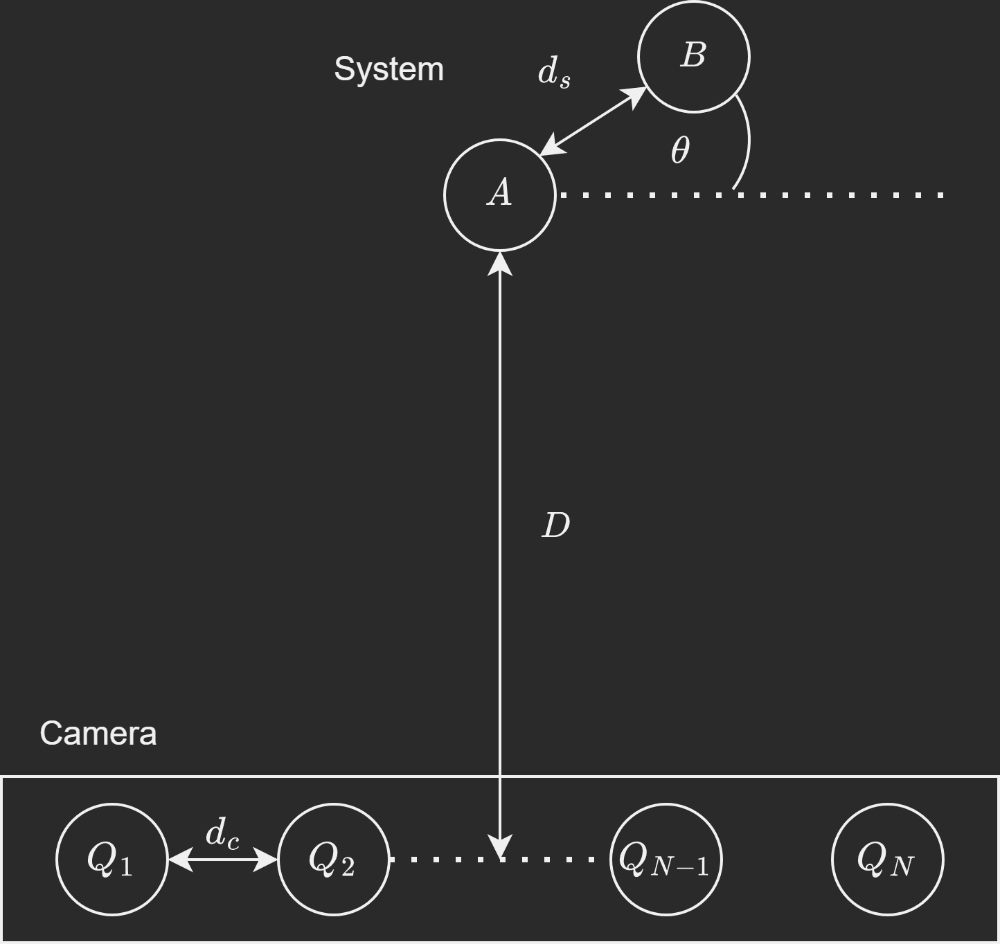
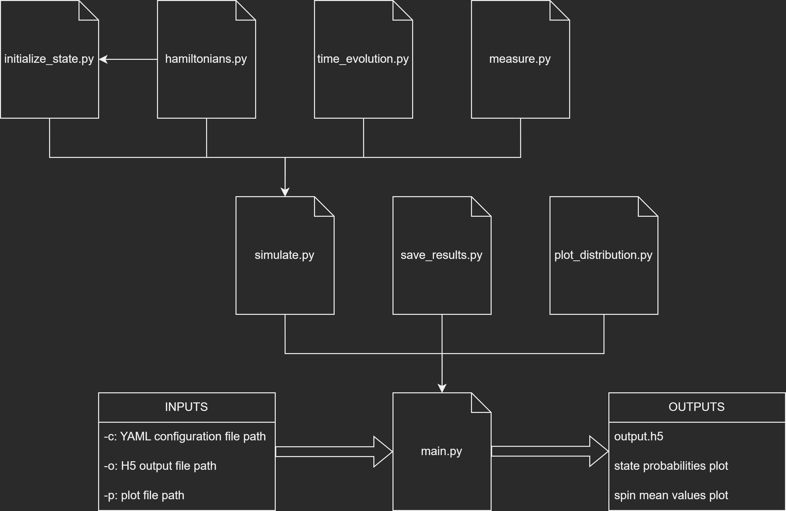
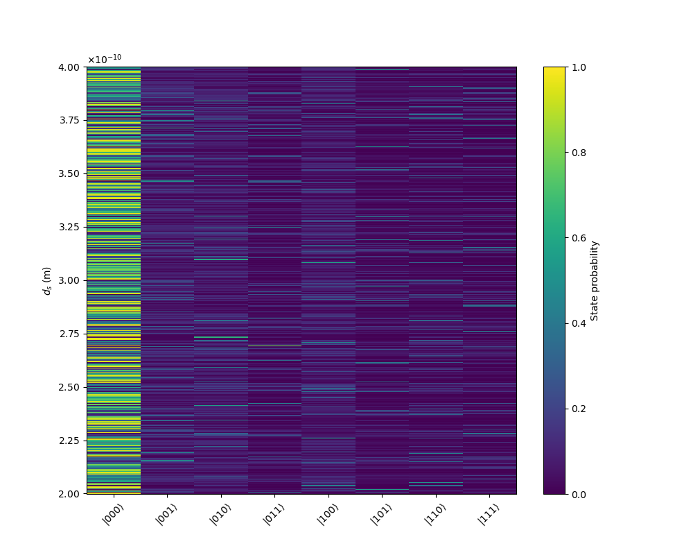
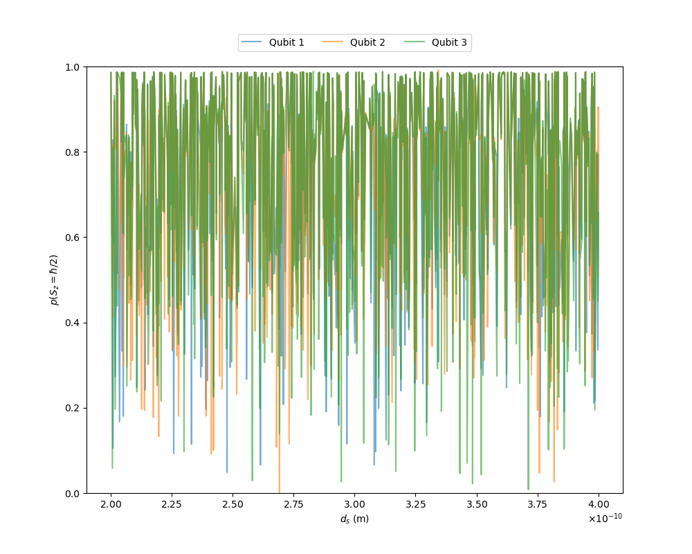
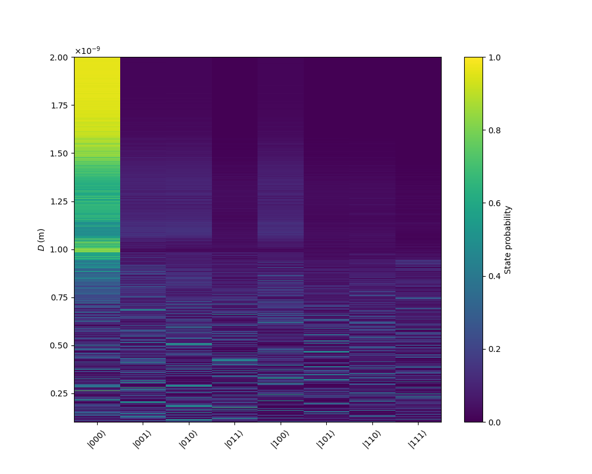
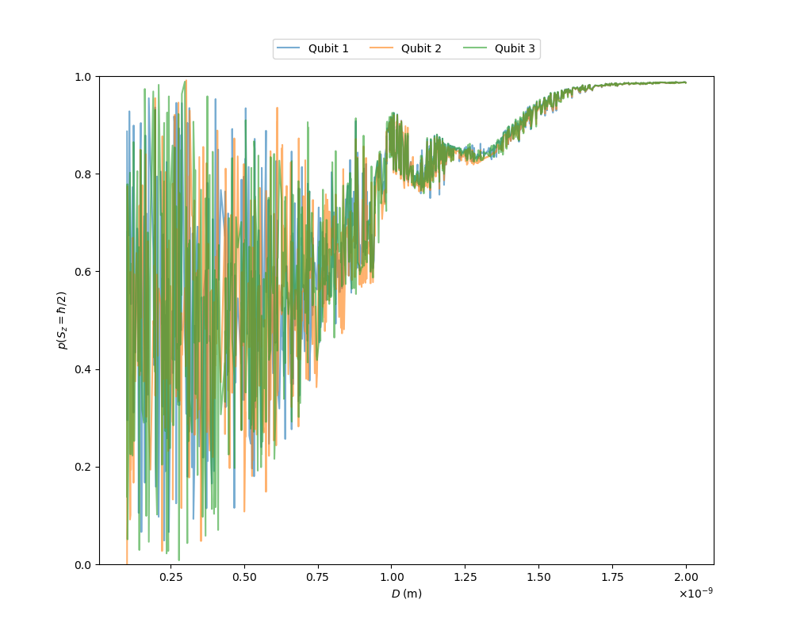
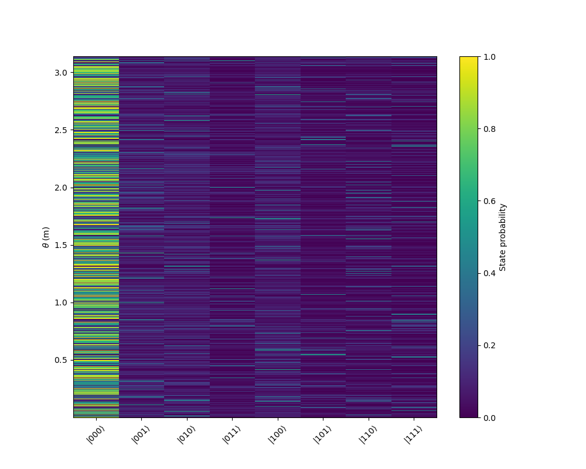
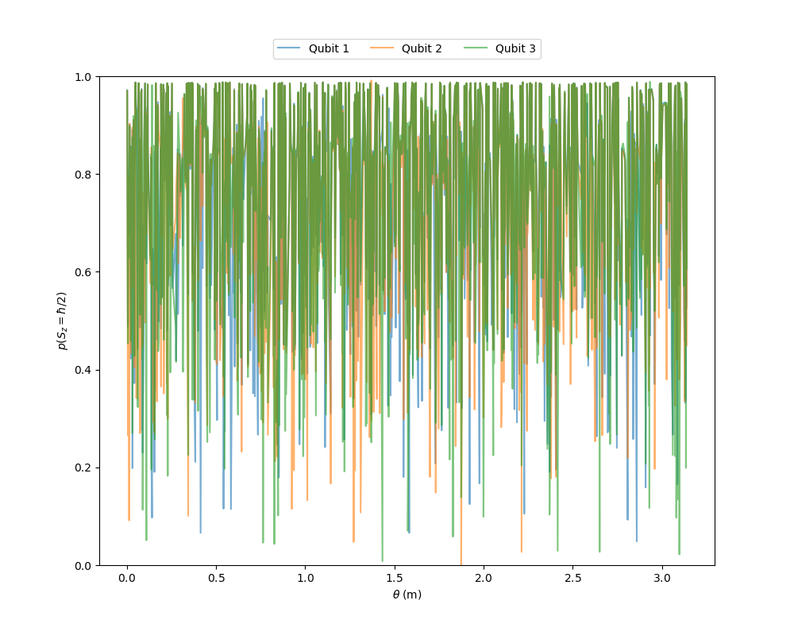

# Quantum-sensor-simulation
Simulate the interaction between a two particle system and a chain of qubits.

$$
\begin{gather}
H_0=\hbar \sum_{i=1}^N\left(D S_{z, i}^2+\gamma B_0 S_{z, i}\right)+\sum_{i, j, i>j} \frac{\mu_0 \gamma^2 \hbar^2}{4 \pi r_{i, j}^3}\left(\vec{S}_i \cdot \vec{S}_j-3\left(\vec{S}_i \cdot \hat{r}_{i, j}\right)\left(\vec{S}_j \cdot \hat{r}_{i, j}\right)\right)\\
H_{\mathrm{e}}=\hbar \gamma B_0\left(\sigma_{z, 1}+\sigma_{z, 2}\right)+\frac{\mu_0 \gamma^2 \hbar^2}{4 \pi d^3}\left(\vec{\sigma}_1 \cdot \vec{\sigma}_2-3\left(\vec{\sigma}_1 \cdot \hat{r}_{1,2}\right)\left(\vec{\sigma}_2 \cdot \hat{r}_{1,2}\right)\right)\\
H_{i n t}=\sum_{\substack{i, j \\ j \in e^{-} \\ i \in \mathrm{NVs}}} \frac{\mu_0 \gamma^2 \hbar^2}{4 \pi r_{i, j}^3}\left(\vec{S}_i \cdot \vec{\sigma}_j-3\left(\vec{S} \cdot \hat{r}_{i, j}\right)\left(\vec{\sigma}_j \cdot \hat{r}_{i, j}\right)\right)
\end{gather}
$$

<p align="center"></p>

## Structure

<!-- TODO: update image -->

<p align="center"></p>

## Set up

```
$ conda env create -f environment.yml
```

## Usage

Specify the parameters of the simulation using a configuration YAML file and run

```
$ python main.py -c [config_file] -o [output_folder]
```

An example of a configuration file is `config.yml`. The parameter `output_folder` takes a default value if it is not specified.

## Example

The following plots are obtained when running

```
$ python main.py -c config.yml
```

<p align="center">


</p>
<p align="center">


</p>
<p align="center">


</p>