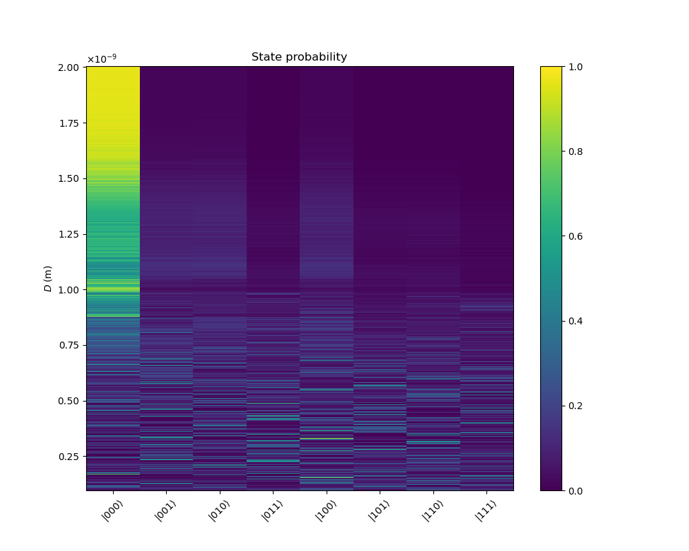
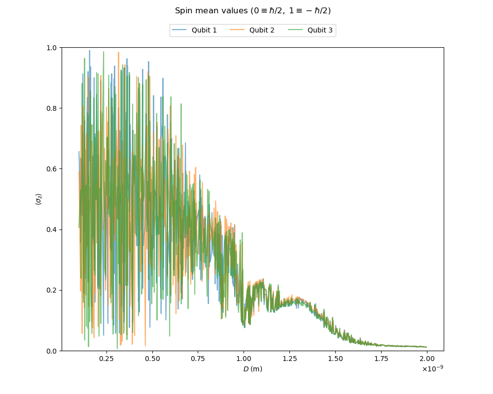

# Quantum-sensor-simulation
Simulate the interaction between a two particle system and a chain of qubits.

<p align="center"></p>

## Structure

<p align="center"></p>

## Set up

```
$ conda env create -f environment.yml
```

## Usage

Specify the parameters of the simulation using a configuration YAML file and run

```
$ python main.py -c [config_file] -o [output_file] -p [plot_file]
```

An example of a configuration file is `config.yml`. The output file must have `.h5` extension. The parameters `output_file` and `plot_file` take default values if they are not specified.

## Example

The following plots are obtained when running

```
$ python main.py -c config.yml -p images/distribution.png
```

<p align="center"></p>

<p align="center"></p>